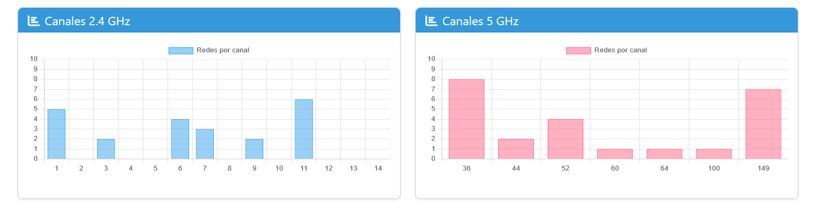
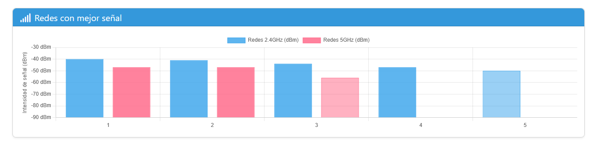
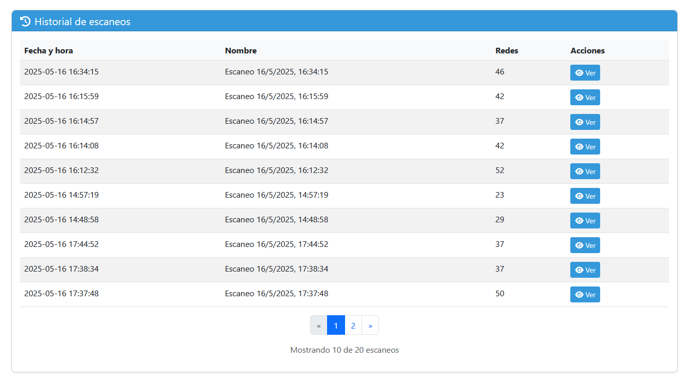
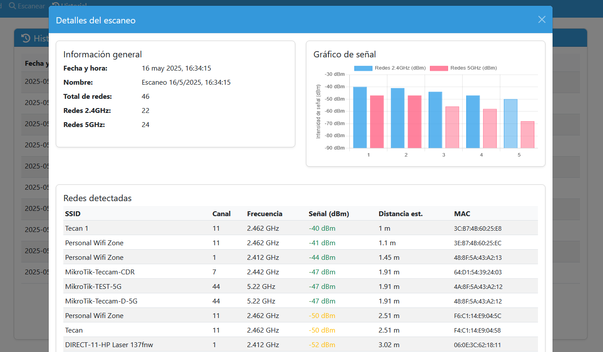

# WiFi Analyzer para Raspberry Pi

Este proyecto utiliza una Raspberry Pi 4 con Debian 12 para analizar redes WiFi en las bandas de 2.4GHz y 5GHz, calcular distancias estimadas basadas en la intensidad de señal (RSSI) y generar visualizaciones gráficas interactivas a través de una interfaz web.

## Características

- Escaneo de redes WiFi en bandas de 2.4GHz y 5GHz
- Cálculo de distancia estimada basado en RSSI
- Interfaz web responsive con Flask
- Visualización interactiva de canales WiFi y su ocupación
- Visualización de lista de redes con detalles
- Gráficos de intensidad de señal con separación por bandas
- Soporte para escaneos continuos con intervalo configurable
- Guardado de resultados en formato JSON y MongoDB
- Historial de escaneos con visualización detallada
- Análisis de tendencias a lo largo del tiempo
- Servicio systemd para ejecución automática

## Requisitos

- Raspberry Pi 4 (o similar) con Debian 12
- Adaptadores WiFi compatibles con 2.4GHz y 5GHz
- Python 3.6 o superior
- Permisos de superusuario para escanear redes WiFi
- MongoDB (opcional, para almacenamiento y análisis de tendencias)

## Instalación

### Instalación automática (recomendada)

1. Clonar el repositorio:
   ```bash
   git clone https://github.com/usuario/wifi-test.git
   cd wifi-test
   ```

2. Ejecutar el script de instalación con privilegios de superusuario:
   ```bash
   sudo ./install.sh
   ```

El script de instalación:
- Verifica e instala los requisitos previos (Python, MongoDB)
- Configura el entorno virtual
- Instala las dependencias
- Configura el servicio systemd
- Inicia la aplicación

Una vez completada la instalación, la aplicación estará disponible en:
- URL local: http://localhost:8000
- URL en la red: http://<IP-del-Raspberry-Pi>:8000

### Instalación manual

Si prefieres realizar la instalación manualmente:

1. Clonar el repositorio:
   ```bash
   git clone https://github.com/usuario/wifi-test.git
   cd wifi-test
   ```

2. Crear y activar un entorno virtual:
   ```bash
   python3 -m venv venv
   source venv/bin/activate
   ```

3. Instalar dependencias:
   ```bash
   pip install -r requirements.txt
   ```

4. Instalar MongoDB para almacenamiento de datos:

   **Opción A: Usando Docker (recomendado para Raspberry Pi 4)**
   ```bash
   sudo docker run -d --name mongodb -p 27017:27017 --restart always mongo:4.4
   ```

   **Opción B: Instalación nativa**
   ```bash
   sudo apt-get update
   sudo apt-get install -y mongodb
   sudo systemctl start mongodb
   sudo systemctl enable mongodb
   ```

5. Configurar el servicio systemd:
   ```bash
   sudo cp wifi-analyzer.service /etc/systemd/system/
   sudo systemctl daemon-reload
   sudo systemctl enable wifi-analyzer.service
   sudo systemctl start wifi-analyzer.service
   ```

## Uso

### Modos de almacenamiento

El programa tiene dos modos de almacenamiento mutuamente excluyentes:

- **Modo JSON** (predeterminado): Guarda los resultados en archivos JSON
- **Modo MongoDB**: Guarda los resultados en una base de datos MongoDB

### Opciones de visualización

La generación de gráficos ahora es explícita y se activa con el parámetro `--generate-graphs`.

### Escaneo único

Para realizar un único escaneo y guardar en JSON (predeterminado):

```
python wifi_analyzer.py --scan
```

Para realizar un único escaneo, guardar en JSON y generar gráficos:

```
python wifi_analyzer.py --scan --generate-graphs
```

Para realizar un único escaneo y guardar en MongoDB:

```
python wifi_analyzer.py --scan --use-mongodb
```

Para realizar un único escaneo, guardar en MongoDB y generar gráficos:

```
python wifi_analyzer.py --scan --use-mongodb --generate-graphs
```

### Visualizar último escaneo

Para visualizar los resultados del último escaneo (desde JSON por defecto):

```
python wifi_analyzer.py --visualize
```

Para visualizar los resultados del último escaneo desde MongoDB:

```
python wifi_analyzer.py --visualize --use-mongodb
```

### Escaneo continuo

Para realizar escaneos continuos cada 60 segundos (guardando en JSON):

```
python wifi_analyzer.py --continuous --interval 60
```

Para realizar escaneos continuos y generar gráficos:

```
python wifi_analyzer.py --continuous --interval 60 --generate-graphs
```

Para realizar escaneos continuos y guardar en MongoDB:

```
python wifi_analyzer.py --continuous --interval 60 --use-mongodb
```

Para realizar un número específico de escaneos:

```
python wifi_analyzer.py --continuous --interval 60 --count 10
```

Para guardar los resultados en un directorio específico:

```
python wifi_analyzer.py --continuous --interval 60 --output-dir ./resultados
```

### Operaciones con MongoDB

Para importar archivos JSON existentes a MongoDB:

```
python wifi_analyzer.py --use-mongodb --import-json
```

### Análisis de tendencias

Para generar gráficos de tendencias de los últimos 7 días:

```
python wifi_analyzer.py --use-mongodb --trends --days 7
```

Para generar gráficos de tendencias de una red específica:

```
python wifi_analyzer.py --use-mongodb --trends --days 7 --network "Nombre de la Red"
```

## Cálculo de Distancia

El cálculo de distancia se basa en el modelo de pérdida de propagación logarítmica:

```
d = 10^((TxPower - RSSI) / (10 * n))
```

Donde:
- d = distancia estimada en metros
- TxPower = potencia de transmisión a 1 metro (típicamente entre -30 dBm y -50 dBm)
- RSSI = intensidad de señal recibida en dBm
- n = factor de propagación (2 en espacio libre, 2.7-4 en interiores)

## Gestión del servicio

Se proporciona un script para gestionar fácilmente el servicio:

```bash
# Iniciar el servicio
./manage-service.sh start

# Detener el servicio
./manage-service.sh stop

# Reiniciar el servicio
./manage-service.sh restart

# Ver el estado del servicio
./manage-service.sh status

# Ver los logs del servicio
./manage-service.sh logs
```

Para más detalles sobre la gestión del servicio, consulta [docs/servicio_systemd.md](docs/servicio_systemd.md).

## Visualización de señales WiFi

La aplicación muestra los datos de señal WiFi de forma intuitiva, transformando los valores negativos de dBm a una escala positiva para una mejor interpretación visual. Para más detalles sobre cómo se visualizan las señales, consulta [docs/visualizacion_senales.md](docs/visualizacion_senales.md).

## Estructura del Proyecto

- `app.py`: Aplicación principal Flask
- `config.py`: Configuración de la aplicación
- `scanner.py`: Módulo para escanear redes WiFi
- `db.py`: Módulo para interactuar con MongoDB
- `templates/`: Plantillas HTML para la interfaz web
- `static/`: Archivos estáticos (CSS, JavaScript, imágenes)
- `install.sh`: Script para instalación automática
- `wifi-analyzer.service`: Configuración del servicio systemd
- `manage-service.sh`: Script para gestionar el servicio
- `docs/`: Documentación del proyecto
  - `visualizacion_senales.md`: Documentación sobre la visualización de señales
  - `servicio_systemd.md`: Documentación sobre el servicio systemd

## Ejemplos de Visualizaciones

### Gráfico de Canales


### Lista de Redes


### Gráfico de Tendencias


### Gráfico de Intensidad de Señal


## Licencia

Este proyecto está licenciado bajo la Licencia MIT - ver el archivo LICENSE para más detalles.

## Contribuciones

Las contribuciones son bienvenidas. Por favor, abra un issue para discutir los cambios propuestos.
